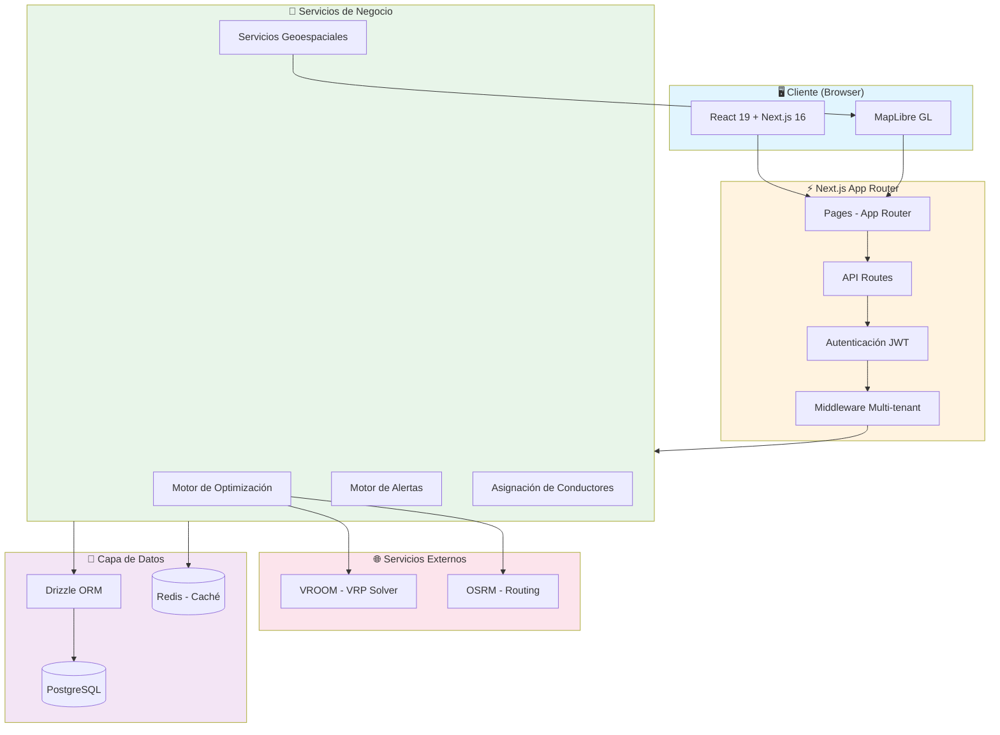
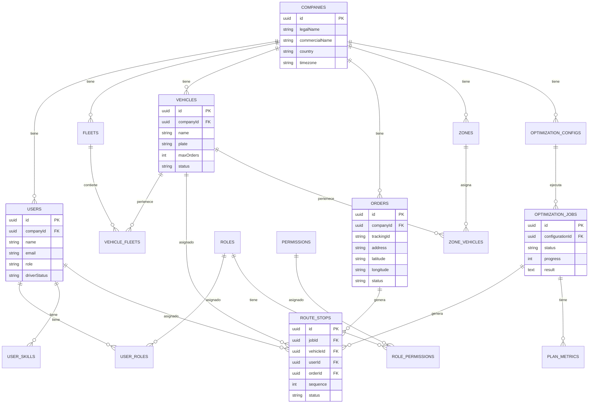
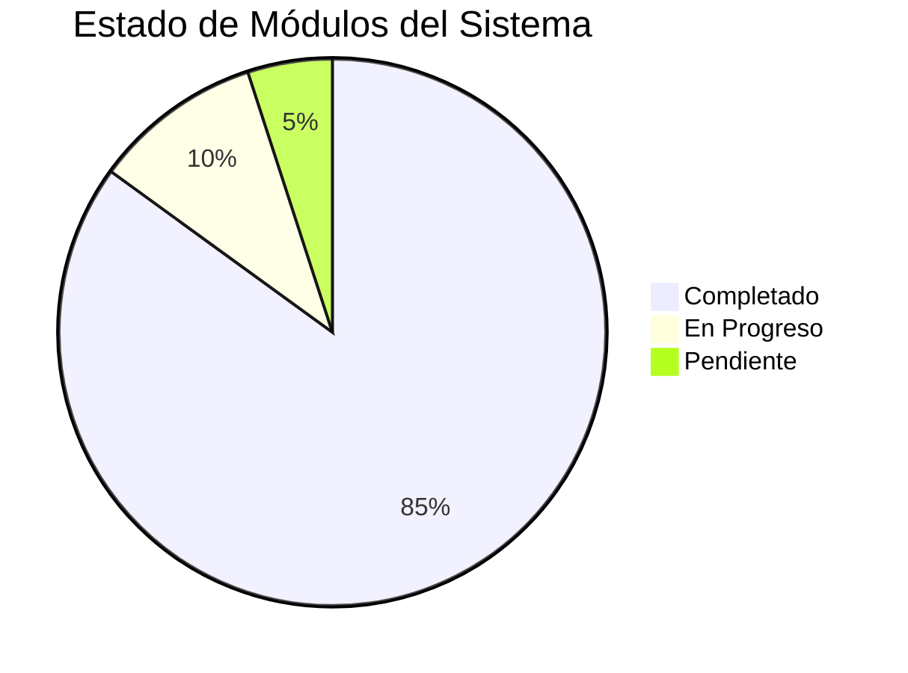
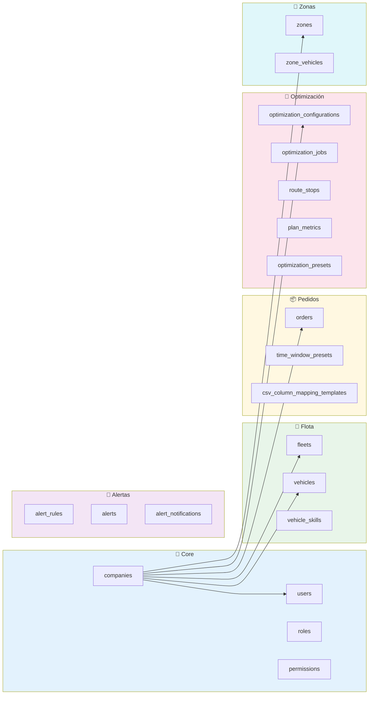
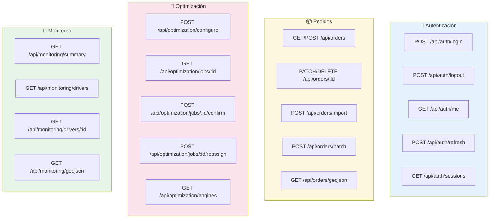
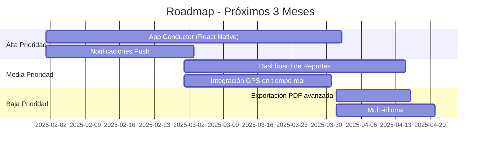
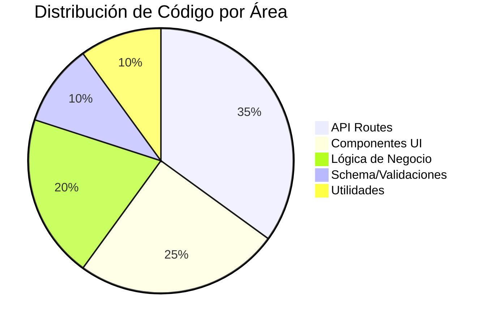

# 📋 Estado del Proyecto - Sistema de Planificación de Rutas

> **Última actualización:** Enero 2025
> **Stack tecnológico:** Next.js 16 + React 19 + Drizzle ORM + PostgreSQL + VROOM

---

## 📊 Resumen Ejecutivo

Sistema de planificación y optimización de rutas de entrega multi-empresa con capacidades de:

| Funcionalidad | Estado | Progreso |
|---------------|--------|----------|
| Multi-tenancy | ✅ Completado | 100% |
| Gestión de Flotas | ✅ Completado | 100% |
| Gestión de Vehículos | ✅ Completado | 100% |
| Gestión de Conductores | ✅ Completado | 100% |
| Importación de Pedidos | ✅ Completado | 100% |
| Optimización de Rutas | ✅ Completado | 100% |
| Monitoreo en Tiempo Real | ✅ Completado | 95% |
| Sistema de Alertas | ✅ Completado | 90% |
| Roles y Permisos | ✅ Completado | 100% |
| Zonas Geográficas | ✅ Completado | 100% |

---

## 🏗️ Arquitectura del Sistema

### Diagrama de Arquitectura General



### Diagrama de Modelo de Datos



### Flujo de Optimización de Rutas

```mermaid
sequenceDiagram
    participant U as 👤 Usuario
    participant FE as 🖥️ Frontend
    participant API as ⚡ API
    participant OPT as 🧮 Optimizador
    participant VROOM as 🚛 VROOM
    participant DB as 💾 PostgreSQL

    U->>FE: 1. Selecciona vehículos y pedidos
    FE->>API: 2. POST /api/optimization/configure
    API->>DB: 3. Crear configuración
    DB-->>API: 4. ID de configuración

    FE->>API: 5. GET /api/optimization/jobs/{id}
    API->>OPT: 6. Iniciar optimización
    OPT->>DB: 7. Cargar pedidos y vehículos

    OPT->>VROOM: 8. Enviar problema VRP
    VROOM-->>OPT: 9. Solución optimizada

    OPT->>OPT: 10. Post-procesamiento (balanceo)
    OPT->>DB: 11. Guardar rutas y métricas

    OPT-->>API: 12. Resultado completo
    API-->>FE: 13. Rutas optimizadas
    FE-->>U: 14. Mostrar en mapa

    U->>FE: 15. Confirmar plan
    FE->>API: 16. POST /api/optimization/jobs/{id}/confirm
    API->>DB: 17. Crear route_stops
    API->>DB: 18. Actualizar estados
    DB-->>API: 19. Plan confirmado
    API-->>FE: 20. Éxito
```

---

## 📁 Estructura del Proyecto

```
src/
├── app/                          # Next.js App Router
│   ├── (protected)/              # Rutas protegidas
│   │   ├── companies/            # 🏢 Gestión de empresas
│   │   ├── configuracion/        # ⚙️ Configuración general
│   │   ├── dashboard/            # 📊 Dashboard principal
│   │   ├── drivers/              # 👤 Gestión de conductores
│   │   ├── driver-skills/        # 🎯 Habilidades de conductores
│   │   ├── fleets/               # 🚛 Gestión de flotas
│   │   ├── monitoring/           # 📡 Monitoreo en tiempo real
│   │   ├── optimization-presets/ # 🎛️ Presets de optimización
│   │   ├── orders/               # 📦 Gestión de pedidos
│   │   ├── planificacion/        # 🗺️ Planificación de rutas
│   │   ├── roles/                # 🔐 Gestión de roles
│   │   ├── time-window-presets/  # ⏰ Ventanas horarias
│   │   ├── users/                # 👥 Gestión de usuarios
│   │   ├── user-skills/          # 🎖️ Habilidades de usuarios
│   │   ├── vehicles/             # 🚗 Gestión de vehículos
│   │   ├── vehicle-skills/       # 🔧 Habilidades de vehículos
│   │   └── zones/                # 📍 Zonas geográficas
│   ├── api/                      # API Routes
│   │   ├── auth/                 # 🔑 Autenticación
│   │   ├── alerts/               # 🚨 Sistema de alertas
│   │   ├── companies/            # Empresas API
│   │   ├── driver-assignment/    # Asignación de conductores
│   │   ├── fleets/               # Flotas API
│   │   ├── monitoring/           # Monitoreo API
│   │   ├── optimization/         # Optimización API
│   │   ├── orders/               # Pedidos API
│   │   ├── reassignment/         # Reasignación de rutas
│   │   ├── roles/                # Roles API
│   │   ├── route-stops/          # Paradas de ruta
│   │   ├── users/                # Usuarios API
│   │   ├── vehicles/             # Vehículos API
│   │   └── zones/                # Zonas API
│   └── login/                    # Página de login
├── components/                   # Componentes React
│   ├── alerts/                   # Componentes de alertas
│   ├── auth/                     # Componentes de autenticación
│   ├── monitoring/               # Componentes de monitoreo
│   ├── planificacion/            # Componentes de planificación
│   └── ui/                       # Componentes UI (shadcn)
├── db/                           # Capa de datos
│   ├── schema.ts                 # Esquema Drizzle
│   ├── index.ts                  # Conexión DB
│   └── tenant-aware.ts           # Queries multi-tenant
├── hooks/                        # Custom React Hooks
├── lib/                          # Librerías de negocio
│   ├── alerts/                   # Motor de alertas
│   ├── auth/                     # Autenticación y autorización
│   ├── export/                   # Exportación Excel/PDF
│   ├── geo/                      # Servicios geoespaciales
│   ├── infra/                    # Infraestructura (caché, audit)
│   ├── optimization/             # Motor de optimización
│   ├── orders/                   # Lógica de pedidos
│   ├── routing/                  # Generación de rutas
│   └── validations/              # Esquemas de validación Zod
└── types/                        # Tipos TypeScript
```

---

## ✅ Módulos Completados

### Diagrama de Estado de Módulos



### 🟢 Módulos Completados (85%)

| Módulo | Descripción | Características |
|--------|-------------|-----------------|
| **Multi-tenancy** | Sistema multi-empresa | Aislamiento de datos por empresa, perfiles de optimización |
| **Autenticación** | JWT + Sesiones | Login, logout, refresh tokens, gestión de sesiones |
| **Usuarios** | CRUD completo | Roles, permisos, conductores, administradores |
| **Roles y Permisos** | RBAC configurable | Permisos granulares por módulo y acción |
| **Flotas** | Gestión de flotas | Tipos de flota, capacidades, horarios |
| **Vehículos** | Gestión de vehículos | Estados, capacidades, asignación de conductores |
| **Pedidos** | Gestión de pedidos | CRUD, importación CSV, estados |
| **Optimización** | Motor VROOM | VRP, ventanas horarias, capacidades, habilidades |
| **Zonas** | Zonas geográficas | Polígonos GeoJSON, asignación de vehículos |
| **Presets** | Configuraciones | Ventanas horarias, optimización |

### 🟡 Módulos En Progreso (10%)

| Módulo | Estado | Pendiente |
|--------|--------|-----------|
| **Monitoreo** | 95% | Notificaciones push en tiempo real |
| **Alertas** | 90% | Notificaciones por email/SMS |

### 🔴 Módulos Pendientes (5%)

| Módulo | Prioridad | Descripción |
|--------|-----------|-------------|
| **App Conductor** | Alta | Aplicación móvil para conductores |
| **Reportes** | Media | Dashboard de reportes y KPIs |

---

## 📊 Entidades del Sistema

### Resumen de Tablas de Base de Datos



### Conteo de Entidades

| Categoría | Tablas | Descripción |
|-----------|--------|-------------|
| **Core** | 6 | companies, users, roles, permissions, role_permissions, user_roles |
| **Flota** | 8 | fleets, vehicles, vehicle_fleets, vehicle_skills, vehicle_status_history, vehicle_fleet_history |
| **Usuarios** | 5 | user_skills, user_availability, user_secondary_fleets, user_driver_status_history, user_fleet_permissions |
| **Pedidos** | 3 | orders, time_window_presets, csv_column_mapping_templates |
| **Optimización** | 6 | optimization_configurations, optimization_jobs, optimization_presets, route_stops, route_stop_history, plan_metrics |
| **Alertas** | 3 | alert_rules, alerts, alert_notifications |
| **Zonas** | 2 | zones, zone_vehicles |
| **Auditoría** | 3 | audit_logs, reassignments_history, output_history |
| **Total** | **36** | |

---

## 🔌 API Endpoints

### Resumen de Endpoints por Módulo



### Lista Completa de Endpoints

| Módulo | Endpoints | Métodos |
|--------|-----------|---------|
| **Auth** | 7 | login, logout, me, refresh, sessions |
| **Companies** | 2 | CRUD empresas |
| **Users** | 5 | CRUD usuarios, roles, sesiones |
| **Roles** | 4 | CRUD roles y permisos |
| **Fleets** | 4 | CRUD flotas |
| **Vehicles** | 6 | CRUD vehículos, estados |
| **Orders** | 8 | CRUD pedidos, importación, batch |
| **Optimization** | 8 | Configuración, jobs, métricas |
| **Monitoring** | 4 | Resumen, conductores, GeoJSON |
| **Alerts** | 6 | CRUD alertas, reglas |
| **Zones** | 3 | CRUD zonas |
| **Route Stops** | 3 | CRUD paradas |
| **Total** | **~60** | |

---

## 🚀 Próximos Pasos

### Prioridad Alta 🔴



### Tareas Pendientes Priorizadas

| # | Tarea | Prioridad | Esfuerzo | Impacto |
|---|-------|-----------|----------|---------|
| 1 | **App Conductor (React Native)** | 🔴 Alta | Alto | Alto |
| 2 | **Notificaciones push en monitoreo** | 🔴 Alta | Medio | Alto |
| 3 | **Integración con GPS en tiempo real** | 🔴 Alta | Alto | Alto |
| 4 | **Dashboard de reportes y KPIs** | 🟡 Media | Medio | Medio |
| 5 | **Notificaciones por email/SMS** | 🟡 Media | Medio | Medio |
| 6 | **Exportación PDF de planes** | 🟡 Media | Bajo | Bajo |
| 7 | **Histórico de métricas comparativas** | 🟢 Baja | Bajo | Bajo |
| 8 | **Soporte multi-idioma (i18n)** | 🟢 Baja | Medio | Bajo |

---

## 🔧 Stack Tecnológico

### Frontend
- **Framework:** Next.js 16 (App Router)
- **UI Library:** React 19 con React Compiler
- **Componentes:** shadcn/ui + Radix UI
- **Estilos:** Tailwind CSS 4
- **Mapas:** MapLibre GL
- **Estado:** SWR para data fetching
- **Validación:** Zod

### Backend
- **Runtime:** Bun
- **Framework:** Next.js API Routes
- **ORM:** Drizzle ORM
- **Base de Datos:** PostgreSQL
- **Caché:** Redis (Upstash)
- **Autenticación:** JWT (jose)

### Optimización
- **Motor VRP:** VROOM
- **Routing:** OSRM
- **Algoritmo Fallback:** Nearest Neighbor

### DevOps
- **Linting:** Biome
- **Testing E2E:** Playwright
- **Containerización:** Docker

---

## 📈 Métricas del Proyecto



| Métrica | Valor |
|---------|-------|
| **Tablas de BD** | 36 |
| **Endpoints API** | ~60 |
| **Páginas UI** | 21 |
| **Componentes** | ~50 |
| **Archivos TypeScript** | ~150 |
| **Líneas de código (estimado)** | ~25,000 |

---

## 📚 Documentación Relacionada

- [Roles y Permisos](./ROLES-PERMISSIONS.md)
- [Sistema de Optimización](./SISTEMA_OPTIMIZACION.md)
- [Deployment y Routing](./DEPLOYMENT-ROUTING.md)

---

> 📝 **Nota:** Este documento se actualiza periódicamente para reflejar el estado actual del proyecto.
